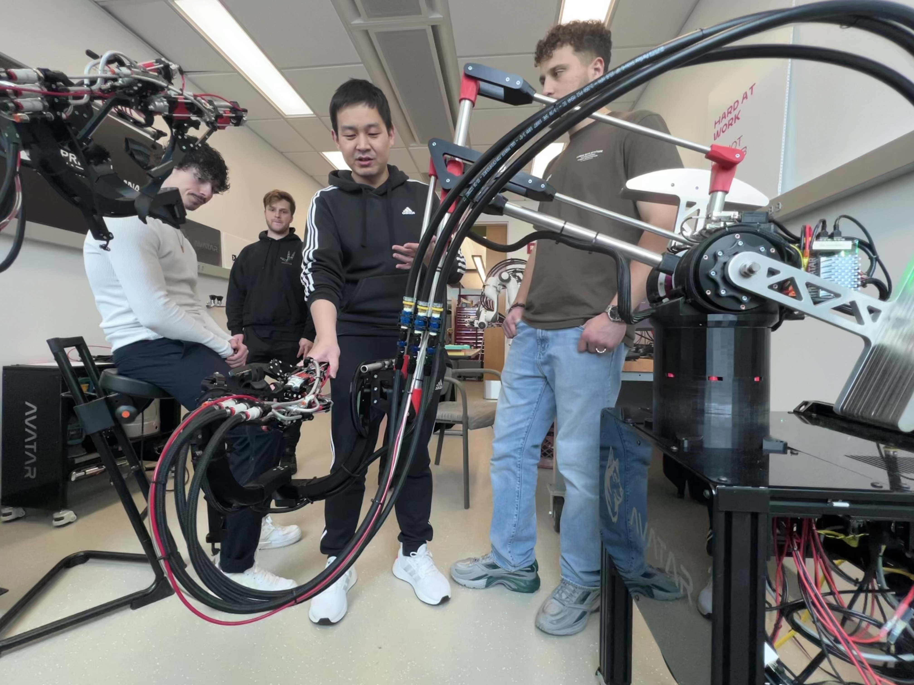

Instructions
============

.. _control-instructions:

How to start gripper and arm control
------------------------------------
Before starting code, a few checks and preparations are needed:

* **Pressure check:** Check all pressure gauges (two on smart arm base and one on avatar side) to see if they are 60 psi. 
  If below 60 psi, use a hand air pump to increase to 60 psi.

* **Motor drives power check:** Check all motor drives if they show green light. For a smarty arm setup, need to release 
  emergency stop and put a makita battery, then turn on switch to "auto". For avatar side, turn on switch labeled as "NUC".
  The drivebase must be powered on before starting code.

* **Panda arm preperation:** Turn on panda arm. A blink yellow light means it's turning on and a constant yellow light means 
  it's ready. Open a web browser from local or remote and type "10.103.1.12" and "10.103.1.14" to get access to franka 
  interface. Then, turn off brakes by clicking an "unlock" button, a blue or white light verifies the arm is unlocked. Next, 
  go to upright part and click "activate FCI" button. Finally, rotate the "left panda" and "right panda" switches located below 
  the front display to make the light turn white.

  
* **Alternative method to start Panda (Recommended)**: 
  
In the first session, run the following code to start left panda:

.. code-block:: console

   $ lfranka
   
In the second session, run the following code to start left panda:
  
.. code-block:: console

   $ rfranka

You should now hear the "clicking" sound from the release of the Panda gear. If error occurs, please double check that the drive base
is powered on. You can also check by pinging 10.103.1.1 to see if the router is powered on.

On another terminal:

.. code-block:: console

   $ roscore

If roscore is already running, ignore it here. The first row means left and right panda arm control; the second row means left 
right gripper control code; the third row means left and right gripper interface. Remember to start control before interface.

Now, it's time for operator Smarty arms need to put into the position shown below. (Only duding `lsa` and `rsa` commands)

Here is an example of the initial pose of the (left) smarty arm:

Then, open another terminator window, split it into eight subwindows, and type the following commands:

.. list-table:: operator_command
   :widths: 50 50

   * - lsa
     - rsa
   * - lsai
     - rsai

The first row means left and right smarty arm control; the second row means left and right smarty arm interface. Remember to start control before interface.

The gloves and grippers teleoperation is ready. An operator is ready to wear both gloves. Whenever the operator is ready, rotate 
the "left panda" and "right panda" on avatar side (or the foot padels if connected) to turn the arms into blue light. Panda arms will slowly catch operator's smarty arm 
position and is ready when operator can feel force from smarty arm.

To start both Proteus gripper, run:
.. code-block:: console

   $ proteus

You can also start left and right proteus gripper separately by running:
.. code-block:: console

   $ lproteus
   $ rproteus

.. _video-instructions-operator:

How to start the video (operator side)
--------------------------------------

Open the terminal with predefined layout, this will pop up a terminal with 8 panels, it doesn't matter which terminal you 
run the following commands, only the order matters:

.. code-block:: console

   $ terminator -l avatar
   
If roscore hasn't been run yet, in any of the opened terminal window, ssh into xnuc0 and then start roscore:

.. code-block:: console
    
   $ xnuc0 
   $ roscore

**Discovery center:** In terminal 1, start discovery by running 

.. code-block:: console

   $ discovery

**Main Camera:** In terminal 2, start main camera receiver by running

.. code-block:: console

   $ recv_main_node

The program will start listening to the main camera feed, once you started the sender, the main camera view will show up 
automatically.  
If you encountered an error saying *cannot connect to ROS master*, that means the ROS core is not started yet.
Please refer to step 2.

**Operator camera:** In terminal 3, start operator view sender by running

.. code-block:: console

   $ send_operator_video

**Peripheral Camera:** To receive peripheral view is a bit more complicated (don't worry, it's only two more steps).
First open :code:`obs` in terminal 4 by running

.. code-block:: console

   $ obs

If you have followed :ref:`video-instructions-avatar`, you should be able to see the wide angle camera view. Right click it and
project it onto the Sumsung monitor. **(Add a picture or gif here)**

.. _video-instructions-avatar:

How to start the video (avatar side)
------------------------------------
Use NoMachine to log into the remote video NUC (avatar_bd).
Open the terminal with predefined layout, this will pop up a terminal with 6 panels, it doesn't matter which terminal you 
run the following commands, only the order matters:

.. code-block:: console

   $ terminator -l avatar

**Main Camera:** In terminal 1, start main camera sender by running

.. code-block:: console

   $ send_main

**Peripheral Camera:** In terminal 2, start peripheral camera sender by running

.. code-block:: console

   $ send_left

**Operator Camera:** We use :code:`obs` to receive operator view (due to my code not able to receive cropped 
video properly somehow..). In terminal 3, run 

.. code-block:: console

   $ obs

In obs you should be able to see only one source, right click and select **project to fullscreen**.
**(Add a picture or gif here)**. You might adjust the webcam on top of the camera to center the operator face.

.. _audio-instructions-avatar:

How to start the audio (avatar side)
--------------------------------------

.. _audio-instructions-operator:

How to start the audio (operator side)
--------------------------------------

.. _bleed-system:

How to bleed the system
-----------------------
First of all, you need to get up at 6am!
